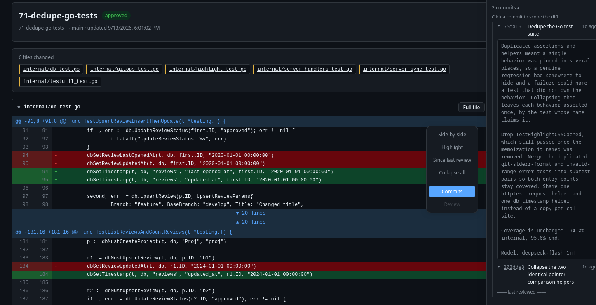
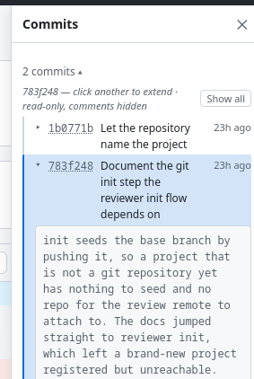
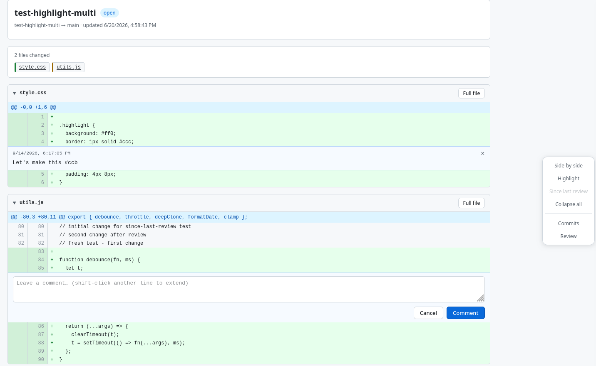
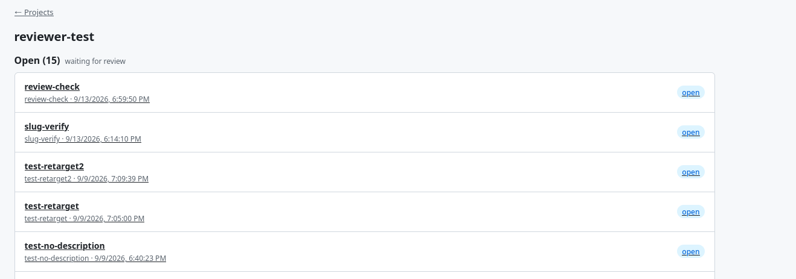

This document and its contents are written and maintained by a human.

# reviewer

`reviewer` is a small self-hosted code review tool and light-weight workflow for reviewing agent-generated changes locally.

Somewhere around the thousandth time you give your agent permission to continue working, something slips through: some architectural choice that isn't what you meant, an object that's getting bloated, or some weird backwards-compatibility code gymnastics the agent applies to an internal-only implementation.

Even when writing code directly, I have a tendency to overlook minor things until I see the change up on GitHub, in actual PR form.  This holds true for agent-generated code as well.  That step back to look at the changes - without scrolling through diff markers in an editor - often makes it easier to catch issues.

This tool helps by allowing you to perform a local review (similar to GitHub PRs), and annotate the code with comments for your agents to address.  Once you approve the changes, you or the agent can push the branch to your normal upstream such as GitHub, GitLab, etc for collaborative review.
'
Using the sample commit script (see docs/examples), review comments are automatically captured in the commit message the agent pushes. This ensures comments are kept with the commit, instead of lost in a local database on your machine. This could probably also be done via a repo hook instead of a special commit script.

By design, review comments/annotations are one-way.  There's no API or tooling that allows the agent to reply -- if you need a conversation with the agent, your preferred harness is the best tool for that job.

This repository contains a sample workflow in which the agent does most of the work: creating commits, pushing, waiting for review comments, and applying changes based on comments. The instructions to do this can be turned into a skill or used directly - they're pretty lightweight at an estimated 500-700 tokens depending on model.

## Features

* local-only lightweight code review workflow for agent-generated code
* minimal agent instructions required, even for local agents.
* web UI for reviewing changes and leaving comments
  * see open reviews and their status
  * supports multi-line code selection for comments, and comments on deleted lines.
  * syntax coloring (toggleable) for many languages via chroma
  * side-by-side and unified diff views
  * dark-mode support
  * per-commit views
  * view changes since last review
* handles rebases/force pushes with reasonable grace.
* comments/change requests can be preserved with the commit message to retain context without relying on a local tool

## Screen Captures









## Architectural Overview

  * running `reviewer init` creates a local bare-bones git repository (default: `~/.config/reviewer/repos/<project-name>.git`) and adds it to your repository as remote named `review`.  The repo contains two hooks:
    * pre-receive: verifies that the reviewer service is locally available, and rejects the push if not.
    * post-receive: creates the review (via POST to api/hooks/post-receive), and replies with the review URL for the operator.
  * project and review records are stored in a SQLite database (default: `~/.config/reviewer/reviewer.db`).
  * `reviewer serve` starts the REST and UI services. You can access the UI from the browser at http://localhost:8192 (default port)
  * webui is a plain html/js/css SPA that does not make use of any third party resources/external deps
  * this is a single-user tool, with no authentication - therefore it will only listen on loopback.

It also does some work to keep things in sync, so that if branches are force-pushed or deleted it correctly resyncs/tracks them in the DB .

## Other notes

The AGENTS.md file contains information on repository layout and contents.

In addition you'll see a package.json/lock. This project makes use of node for testing of the webui bits only. It has no runtime usage.

## Requirements

- (for building or installing) Go 1.26+
- `git`
- `curl` (used by the server-side git hook)

## Quick Start

This quick start is for manual usage. I recommend instead instructing your agent on how to handle these review process steps directly. A sample agent instruction set is provided in [docs/examples/basic-flow/git.md](docs/examples/basic-flow/git.md). It can be used as a skill, or added to your project/global AGENTS.md equivalent. This is similar to the workflow I use.

0. Install from source or via: `go install marcparadise.io/projects/reviewer/cmd/reviewer@latest`
1. Start the server or use the included [systemd unit](docs/examples/reviewer.services): `reviewer serve`, which starts the service on the default port 8091.
2. In your project directory, run `reviewer init`
3. Once you have something to review, push the branch to the `review` remote: `git push review <branch-name>`.  Pushes to the `review` remote will be rejected unless the `reviewer` service is running.
4. Instruct your agent to wait with no timeout for the review to complete: `reviewer wait`
5. Follow the link provided from the `push` to review the changes

Typically the agent would repeat the cycle starting with step '3' - make the changes, commit, push, and wait for the review to complete.

In my workflow (project-dependent), approval typically signals either a merge to main or a push to remote upstream for full review.  The merge path is shown in the example. I also vary on how often I want to review - for some project's it's per-commit, for other's it's per-branch or -feature.

For more detailed instructions, see [docs/getting_started.md](docs/getting_started.md)

### Updates

Sometimes the hooks can get out of sync after an update.  If you pull in a new version of reviewer, run `reviewer install-hooks` to ensure the hooks are up to date, before killing and restarting the server.  This is effectively idempotent.

## Contributions and Future Maintanence

Use at your own risk. This is a personal tool I've found very useful as I've built it over the last few months. However I am not obligated to support it simply because I shared it. I will keep updating this tool for as long as I continue to find it useful and in need of changes. I'm unlikely to accept contributions.

I'll accept suggestions and bug reports in the form of issues, but I'm highly allergic to AI-generated text in public discourse. If I even suspect an issue is LLM word-vomit, I'll close it without looking too closely.

## License

Why AGPL? It leaves you free to modify it without risk as long as you open source your version under the same license. It has a lovely viral effect which discourages corporations from stealing, and you're more or less able to use it for yourself unmodified without risk.   IANAL, restrictions are far more technical than my summary.

## Partial CLI reference

For a full list of commands and options, run `reviewer --help` or `reviewer <command> --help`.  Following are what you're most likely to need:

```
# Run the server
reviewer serve          [--port PORT] [--data-dir DIR]

# Initialize a project for use with reviewer
reviewer init           [--base-branch BRANCH] [--port PORT] [--data-dir DIR]

# Wait for a review to be completed (blocking)
reviewer wait           [BRANCH] [--json] [--timeout DURATION] [--data-dir DIR] [--port PORT]

# Format a block of text indicating the review comments with line number context, suitable for inclusion in a commit message
reviewer response-block [BRANCH] [--data-dir DIR] [--port PORT]

# reinstall the git hooks for all repositories. Useful if they've been modified or you have made changes to e.g. listen port number.
reviewer install-hooks  [--data-dir DIR] [--port PORT]
```

`--data-dir` defaults to `$XDG_CONFIG_HOME/reviewer`. `--branch` defaults to the current branch. `--port` defaults to 8091.

